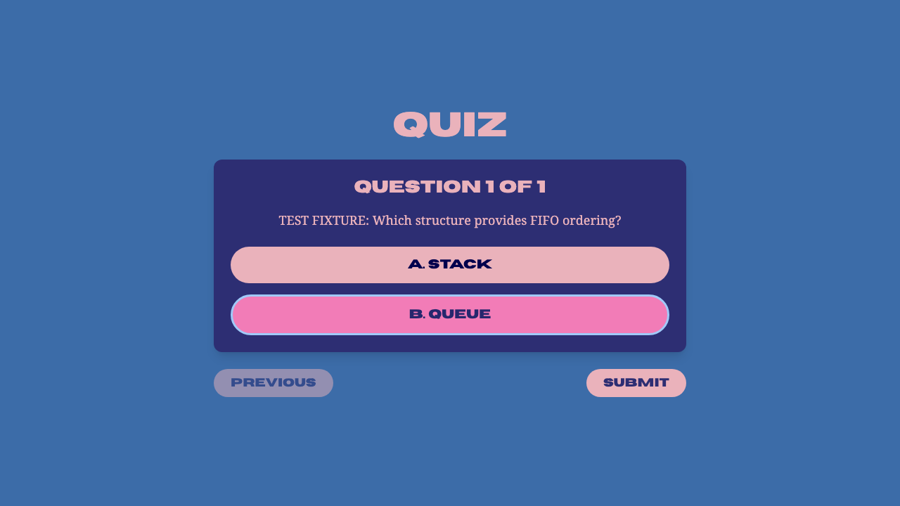

# QuizBee

A quiz platform for studying how reliable software preserves the meaning of an assessment—from a teacher's question file to a student's recorded score.

## The engineering question

Can a system keep quiz content, room timing, authorization and grading consistent when requests are malformed, repeated or late?

QuizBee keeps its original identity as a computer-science project. Instructors import question modules and schedule rooms; students answer questions and inspect ranked results. The useful engineering work is in the boundaries: a score must come from the assigned module, an expired room must reject submissions even before the cleanup job runs, and a failed database write must not leave a contradictory leaderboard.

## What the system enforces

- Instructor-only module import/deletion and room creation/activation, with authorization before upload parsing.
- Complete JSON question validation before one atomic nested module write; malformed later questions cannot leave a partial module.
- Server-side grading against the room's module and legitimate option text. Omitted questions score zero; invented question IDs and options are rejected.
- Request-time start/end checks independent of the minute-based scheduler.
- Atomic attempt/leaderboard persistence. Linked modules cannot be deleted; unlinked question/options/module deletion is transactional.
- HttpOnly session cookies with HTTPS in production and usable local development behavior. Uploads are capped at 5 MB.

Repeated attempts retain the existing policy: each attempt is stored and the latest score updates the leaderboard. This is documented behavior, not an exam-integrity guarantee.



## Architecture

Next.js interface → Express routes and role gates → pure validation/grading domain → Prisma → MongoDB replica set. S3 is optional for profile images. A scheduled job moves rooms between scheduled, active and past states; request-time validation remains authoritative for submission acceptance.

[Architecture](docs/ARCHITECTURE.md) · [Methodology and invariants](docs/METHODOLOGY.md) · [Limitations](docs/LIMITATIONS.md)

## Run locally

Use Node 22 or 24 and a MongoDB replica set. Copy each `.env.example` to `.env` in the same directory, fill the local settings and keep those files untracked. Generate an instructor bcrypt password hash locally with `bcryptjs`; `ADMIN_PWD` stores the hash. Frontend and API should share a site in production.

```sh
npm ci --prefix backend
npm ci --prefix frontend
cd backend
npm run build
npx prisma db push
npm run dev
```

In a second terminal, run `npm run dev --prefix frontend`. Open `http://localhost:3000`. The API defaults to port 3876. Frontend API configuration is embedded at build time and requires its trailing slash.

For a disposable local MongoDB replica set, run the documented [integration setup](docs/TESTING.md). S3 credentials are necessary only for image upload; no credentials are bundled.

## Verification

```sh
npm run test --prefix backend
npm run lint --prefix backend
npm run lint --prefix frontend
npm run typecheck --prefix frontend
npm run build --prefix frontend
npm run test:e2e --prefix frontend
```

Sixteen domain/controller/authorization/session tests, one real MongoDB persistence test and four desktop/mobile browser tests cover this delivery. The database test verifies rollback after an injected leaderboard failure and protects linked module content. Browser fixtures are explicitly synthetic; no real student records or provider uploads are used.

CI installs locked dependencies, generates Prisma, lints, typechecks, tests against MongoDB, builds, runs browser journeys, audits production dependencies and scans tracked text for common secret patterns. See [testing](docs/TESTING.md) and the [delivery report](docs/PORTFOLIO_DELIVERY.md) for exact evidence.

## Further engineering work

Assessment-attempt policy, distributed room scheduling, production rate limits, audit logs, accessibility and multiple instructor organizations are worthwhile extensions. This release does not claim proctoring, anti-cheating guarantees or production load validation.
