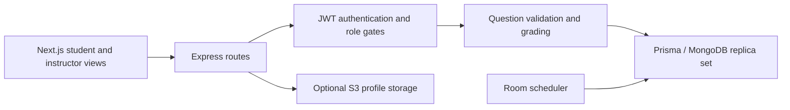

# Architecture

`backend/domain/quiz.js` defines pure grading, question-file and room-window rules. Controller factories accept a Prisma dependency for isolated tests, while normal exports use the generated client. Instructor mutation routes authenticate before Multer reads files. The frontend carries answer text, but the server matches it against actual options from the assigned module.

Imports use a nested Prisma write. Attempts and leaderboard updates share a transaction. Module deletion checks linked rooms and performs dependent deletions transactionally. MongoDB must run as a replica set for these contracts. Database startup awaits the connection before the server listens.

The existing schema spelling `Leaderbaord` is preserved to avoid a gratuitous migration. No existing repository history or data was rewritten.
