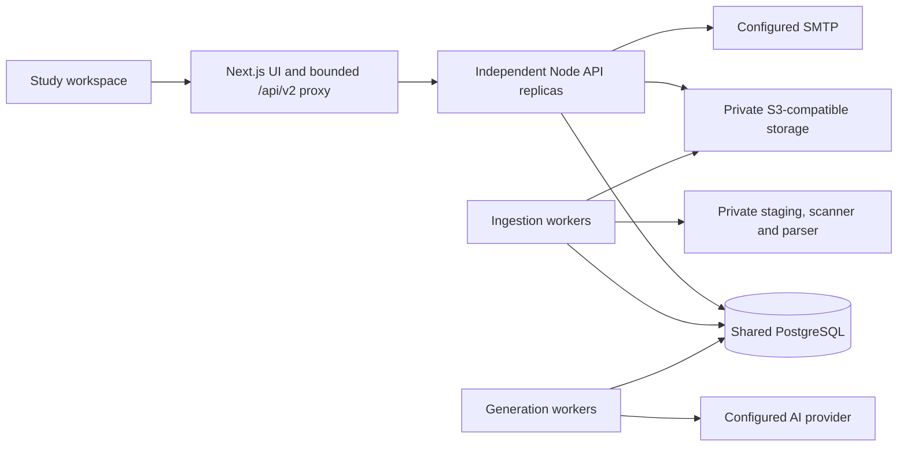

# Architecture

QuizBee 2.0 separates its web interface, API and role-specific workers into independently runnable processes. API replicas and workers share one PostgreSQL transaction boundary and one private storage identity. This is a distributed application with shared transactional state, not database-per-service microservices. The preserved Express/MongoDB stack uses separate data and authentication.

```mermaid
flowchart LR
  Browser[Study workspace] --> Web[Next.js UI and bounded /api/v2 proxy]
  Web --> API[Independent Node API replicas]
  API --> DB[(Shared PostgreSQL)]
  API --> Objects[Private S3-compatible storage]
  API --> SMTP[Configured SMTP]
  Ingestion[Ingestion workers] --> DB
  Ingestion --> Objects
  Ingestion --> Parser[Private staging, scanner and parser]
  Generation[Generation workers] --> DB
  Generation --> Provider[Configured AI provider]
```

## Source and runtime boundaries

- `frontend/src/app/study` and `frontend/src/components/study` render browser workflows. Browser scores and countdowns are presentation, never grading authority.
- `frontend/src/app/api/v2/[...path]/route.ts` delegates to `frontend/src/lib/platform-proxy.ts`. This bounded same-origin gateway preserves browser Origin, cookies and API responses while dropping client-supplied forwarding/identity headers by default. Optional trusted client-IP forwarding requires the controlled-ingress prerequisites in [DEPLOYMENT.md](DEPLOYMENT.md). It reads `PLATFORM_API_URL` at runtime. The frontend has no Prisma client, domain grading code, database credentials or provider credentials.
- `services/platform/src/api/server.ts` adapts bounded Node HTTP requests to standard Request/Response objects. `handler.ts` routes `/api/v2`, authenticates sessions and origins, and applies quotas. `run.ts` owns listener startup and draining.
- `services/platform/src/domain/assessment.ts` validates questions and answers, constructs snapshots, grades objective answers and controls answer disclosure.
- `services/platform/src/server` holds ownership-scoped services, Prisma transactions, identity, courses, manual review, banks, mail and cleanup. Its `ingestion`, `ai` and `jobs` directories implement extraction, source validation, provider calls and leased work.
- `services/platform/prisma` owns the PostgreSQL schema and ordered migrations. Legacy MongoDB remains in `backend/prisma`.

Sessions are opaque random tokens stored as hashes. Mutations reject unknown payload keys and require the configured browser Origin. Instructors can create courses, but ownership and membership still govern access to each resource. Self-service instructor registration does not verify institutional identity.

## State, replicas and jobs

Every quiz save appends an immutable numbered version. Assignments pin one version; attempts store presented questions, shuffle order, settings, review policy, deadline and answer revision. PostgreSQL row locks and bounded transaction retries serialize eligibility decisions, saves and finalization. Database time is read after the relevant lock, so a web/API host clock cannot extend an exam, session or job lease.

Workers select `ingestion`, `generation` or both with `WORKER_KINDS`. They claim queued or expired work using `FOR UPDATE SKIP LOCKED`. Five-minute leases, periodic heartbeats and monotonically increasing attempt counts fence stale workers. Generated quiz creation and job completion share a transaction; source locks serialize publication against deletion. Replicas share these records rather than maintaining separate in-memory queues.

Worker maintenance runs at startup and at loop boundaries at least 60 seconds apart. It finalizes bounded batches of due attempts, drains durable object deletions, and prunes expired sessions, tokens and rate-limit records. Long jobs can delay a sweep; API reads/writes still enforce deadlines. Shutdown stops new claims and allows active work to finish. A crash leaves a lease that can be reclaimed.

## Storage and processing

The API and workers use the same private S3-compatible bucket/prefix across hosts. The local adapter remains available when all participating processes can access the same directory. Changing adapters does not migrate existing keys. See [STORAGE.md](STORAGE.md) for configuration and deletion/versioning limits.

Ingestion stages one object snapshot in a private temporary directory, scans and parses it, and cleans up afterward. Scanner/parser children receive an explicit environment allowlist without database, provider or storage credentials. They retain the worker OS identity and access; resource bounds and environment filtering are not an OS sandbox.

Material/account deletion records opaque storage keys in a transactional `StorageDeletion` outbox. The API commits access revocation and outbox entries without contacting storage. Workers attempt up to five physical deletions concurrently per maintenance sweep; failures remain queued and retries rotate by attempt count, then age. Object storage and PostgreSQL do not participate in a distributed transaction, and application deletion does not erase backups or retained object versions.

## Operation and legacy coexistence

The web exposes `/api/health`; the API exposes `/healthz` and database-backed `/readyz`; workers expose progress/readiness health on their configured port. Docker images run application processes as a non-root user. The local overlay supplies shared services, one-shot migration/bucket initialization and independent worker roles. Runtime health is not proof of provider credentials, scanner quality or production readiness.

Legacy uses JWT cookies and option-text answers; v2 uses revocable PostgreSQL sessions and stable choice IDs. Separate routes provide compatibility, not browser security isolation. Legacy and new pages on one origin share that origin's trust. Public operation requires reviewing the whole served application or separating origins explicitly.

See [DEPLOYMENT.md](DEPLOYMENT.md), [DATABASE.md](DATABASE.md), [ASSESSMENT_INTEGRITY.md](ASSESSMENT_INTEGRITY.md), [DOCUMENT_PROCESSING.md](DOCUMENT_PROCESSING.md) and [LIMITATIONS.md](LIMITATIONS.md).
