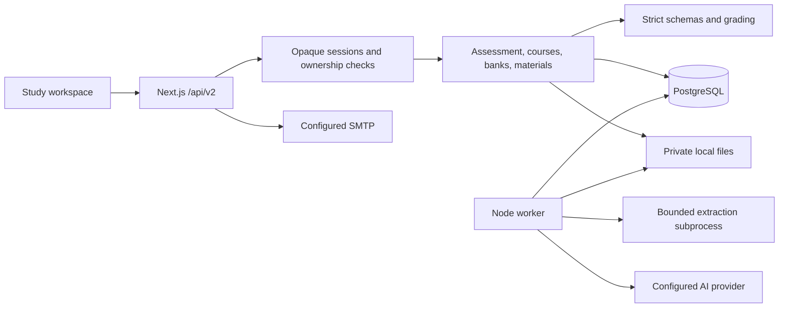

# Architecture

QuizBee 2.0 uses a same-origin Next.js interface and `/api/v2` API, a shared TypeScript domain layer, PostgreSQL through Prisma, and a separate Node.js worker. The existing Express/MongoDB service remains operational under its legacy protocol.

```mermaid
flowchart LR
  Browser[Study workspace] --> API[Next.js /api/v2]
  API --> Auth[Opaque sessions and ownership checks]
  Auth --> Services[Assessment, courses, banks, materials]
  Services --> Domain[Strict schemas and grading]
  Services --> DB[(PostgreSQL)]
  Services --> Files[Private local files]
  Worker[Node worker] --> DB
  Worker --> Files
  Worker --> Extract[Bounded extraction subprocess]
  Worker --> AI[Configured AI provider]
  API --> SMTP[Configured SMTP]
```

## Boundaries and implementation

- `frontend/src/app/study` and `frontend/src/components/study`: browser workflows and rendering. Browser scores and countdowns are presentation, never grading authority.
- `frontend/src/app/api/v2/[...path]/route.ts`: transport routing, session/origin checks, body limits, rate limits and response envelopes.
- `frontend/src/domain/assessment.ts`: validated question and answer shapes, snapshot construction, option validation, objective grading and disclosure rules.
- `frontend/src/server`: ownership-scoped services, Prisma transactions, identity, courses, grading review, private banks, mail and storage cleanup.
- `frontend/src/server/ingestion`, `ai`, and `jobs`: file parsing, source validation, configured provider adapter and leased queue.
- `frontend/prisma`: PostgreSQL schema and ordered migrations. The MongoDB schema remains in `backend/prisma`.

Mutations reject unknown payload keys. Session tokens are opaque random values whose hashes are stored in PostgreSQL. Role checks grant course creation to instructors; ownership and membership still govern individual resources. Selecting instructor at registration does not establish an externally verified professional identity.

## State and concurrency

Every quiz save appends an immutable numbered version. Assignments pin a version, and attempts copy the presented questions, settings, shuffle order and review policy. Attempts store their deadline and current answer revision. Row locks and bounded transaction retries serialize sensitive decisions, including starting an attempt, saving answers and submitting a final grade.

The worker claims queued or expired leased jobs with `FOR UPDATE SKIP LOCKED`. A five-minute lease, heartbeat and monotonically increasing attempt count prevent stale workers from publishing a second result. Generated quiz creation and job completion share a transaction. Source rows are locked during publication, ordering it against deletion.

Deleting material or an account records private file keys in a durable `StorageDeletion` outbox within the database transaction. Immediate cleanup and the worker retry physical deletion. This coordinates eventual filesystem cleanup; it is not a transactional filesystem or a retention guarantee.

Maintenance runs at worker startup and on loop boundaries at least 60 seconds apart. It finalizes up to 100 due attempts through the regular grading engine, drains deletion work, and removes expired session/token/rate-limit rows. A long-running job can delay the next sweep; request-time checks still enforce deadlines.

## Legacy coexistence

The legacy API uses JWT cookies, MongoDB collections and the option-text answer protocol. The new API uses revocable PostgreSQL sessions and stable choice IDs. Their data models and credentials are separate, and no migration is automatic.

Separate routes are a compatibility boundary, **not security isolation**. Legacy and new pages served from the same origin share the browser origin's trust. Public operation would need a review of the whole served application, or origin separation with an explicit migration plan.

See [database](DATABASE.md), [assessment rules](ASSESSMENT_INTEGRITY.md), [processing boundaries](DOCUMENT_PROCESSING.md), and [limitations](LIMITATIONS.md).
