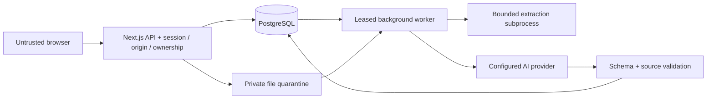

# QuizBee threat model

## Overview
This repository currently contains two application stacks: the preserved Express/MongoDB legacy service and the new Next.js/PostgreSQL platform. This rebuild is tested locally; no production exposure, provider agreement or deployed configuration is assumed. Browsers send untrusted requests. The stacks share a browser origin; an XSS in a legacy route can act against v2 using the browser session. Database separation does not create browser isolation. Private source files enter storage and a separate extraction worker before approved chunks reach an optional AI provider.

| Component | Source | Responsibility |
|---|---|---|
| Legacy API | `backend/index.js`, `backend/routes/*` | Existing JWT/role-gated mutations, public metadata/read policy |
| Platform transport | `frontend/src/app/api/v2/[...path]/route.ts` | Same-origin requests, sessions, per-user quotas, bounded bodies |
| Authentication | `frontend/src/server/auth.ts`, `auth-core.ts`, `mail.ts` | Scrypt passwords, hashed opaque session/reset secrets, revocation |
| Assessment engine | `frontend/src/domain/assessment.ts`, `frontend/src/server/assessment.ts` | Validation, immutable snapshots, server clocks, serialized writes, grading |
| File/AI worker | `frontend/src/server/ingestion/*`, `ai/*`, `jobs/*` | Type/byte/archive checks, bounded extraction, source-constrained generation |
| Storage | `frontend/prisma/schema.prisma`, `compose.yaml` | Separate relational database, private files, local SMTP |

| Workflow | Resource/configuration | Effective location/recipient | Control / prerequisite |
|---|---|---|---|
| Legacy runtime | `DATABASE_URL` | Operator-configured Mongo replica set | Existing backend env; unchanged |
| Platform runtime | `PLATFORM_DATABASE_URL` | Local compose PostgreSQL port 55439 during this work | Distinct frontend generated client; FK and transaction boundaries |
| Uploads | `PRIVATE_STORAGE_DIR` | `.quizbee-private` outside public assets by local default | Generated storage keys; user ownership; authenticated retrieval of chunks |
| Extraction | `MALWARE_SCAN_COMMAND`, `ALLOW_UNSCANNED_UPLOADS` | Local scanner executable or explicitly disclosed development bypass | Production fails closed without scanner; V8 heap cap and timeout, not an OS sandbox |
| Generation | `AI_BASE_URL`, `AI_API_KEY`, `AI_MODEL` | Operator-selected provider only | Never accept destination URL from user; no provider configured by default |
| Account mail | `SMTP_HOST`, `MAIL_FROM`, `APP_ORIGIN` | Local Mailpit ports 1025/8025 for tests | Single-use hashed tokens, expiry, no tokens in application logs |
| Browser session | `quizbee_session` | HttpOnly SameSite=Lax cookie; database stores hash | HTTPS Secure flag; local HTTP explicitly permitted only on loopback |

## Threat model, trust boundaries and assumptions
Assets: credentials and sessions; private materials and extracted passages; correct answers; saved answers/deadlines; grades and authorship; course rosters; provider quotas. Anonymous attackers can invoke public auth endpoints and send arbitrary bytes. Authenticated learners can create their own content and tamper with every browser field. Instructors can manage their own courses, not other instructors' resources. Upload content and AI responses remain untrusted after authentication.

Security invariants:
- A resource ID never establishes ownership or course membership.
- Only validated questions/options in the attempt snapshot may affect a grade.
- A refresh cannot reset time, shuffle order or consumed attempts.
- Final submissions are idempotent and reject further answer changes.
- Question edits never mutate active attempt versions.
- Exam review release uses immutable policy; browser clocks and score fields have no authority.
- Raw credentials, session/reset tokens, documents and student answers do not enter logs.
- AI output must satisfy the quiz schema and cite supplied source chunks; citations do not prove factual accuracy.

Assumptions: operators control server environment, database credentials and scanner executable. HTTPS and trusted proxy configuration are deployment responsibilities. A database administrator can alter records; application append-only audit behavior is not tamper-proof storage. The extraction child inherits the worker environment (including credentials), filesystem access and network privileges. Its 256 MB V8 heap flag does not cap native allocations. A production parser needs a separately hardened, least-privilege container or service with enforced OS resource/network limits. The local single-host environment does not establish production performance or isolation. Legacy public reads and non-revocable JWT sessions remain legacy limitations.

## Attack surface, mitigations and attacker stories
These are threat scenarios, not a claim that every attack has been independently penetration-tested. Confirmed legacy defects are in REBUILD_AUDIT.md; automated verification is recorded in TESTING.md.

| Priority | Scenario/capability gain | Prerequisite / impact | Implemented boundary / residual risk |
|---|---|---|---|
| High | Forge score, option or question ID | Authenticated attacker changes JSON | Strict schemas, snapshot eligibility and server grading; subjective review must remain human |
| High | Edit after deadline or replay submission | Race, refresh or duplicate request | Persisted deadline; row locks; compare-and-swap revision; idempotent finalization; late saves fail |
| High | Read another user's quiz/material/result | Guess or obtain ID | Owner/member queries on every new resource service; legacy public paths deliberately remain separate |
| High | Race starts to exceed attempt quota | Concurrent sessions | Serializable transaction and stable quiz/assignment locks; tests exercise concurrent starts |
| High | Steal or retain a session | XSS, transport compromise, stolen cookie | HttpOnly/Secure cookie, hashed secrets, revocation and password-reset invalidation; XSS and device compromise still require defense in depth |
| High | Exhaust parser with malicious archive | Authenticated file upload | Actual expanded byte budget, entry/ratio limits, traversal/symlink/encrypted/nested archive rules, extraction subprocess; native parser/OS bugs remain possible |
| High | Escape archive path or execute active content | Crafted paths/macros/XML | Generated storage keys, no archive disk extraction, XML external/DTD rejection and macro rejection; no document script execution |
| High | Prompt injection/false model question | Hostile source or model output | Source treated as data, bounded retrieval, strict schema/count/type and quote validation; human review still necessary for consequential assessments |
| Medium | CSRF authenticated mutation | Browser credential forwarding | Exact configured Origin required, SameSite cookie, same-origin API; hosting must protect APP_ORIGIN and forwarded headers |
| Medium | Credential stuffing/provider spend | Automated requests | Shared DB-backed auth/user quotas; trusted proxy opt-in; deployment edge limits needed for distributed volumetric abuse |
| Medium | Leak exam answers through analytics | Submit early, delete/edit parent policy | Review gates use frozen attempt policy across attempt/dashboard views; instructor privileged review is separately scoped |
| Medium | CSV formula execution | Hostile student/course names | Export quotes cells and neutralizes formula/control-character prefixes |
| Low | Overinterpret browser events | Tab switch, assistive tools, reconnect | Optional disclosed event collection, no automated cheating verdict or automatic penalty |

## Severity calibration
Critical means plausible broad unauthenticated compromise of server authority or widespread credential access; this model does not establish one. High covers private cross-user disclosure, unauthorized grade manipulation or practical parser escape. Medium covers bounded abuse, resource exhaustion or metadata leakage depending on exposure and quotas. Low covers self-only presentation mistakes and informational configuration limitations. A browser user editing their own private practice quiz is intended authority, not a finding. Second devices, offline notes and external assistance are beyond browser controls; high-stakes exams still require appropriate supervised procedures.
